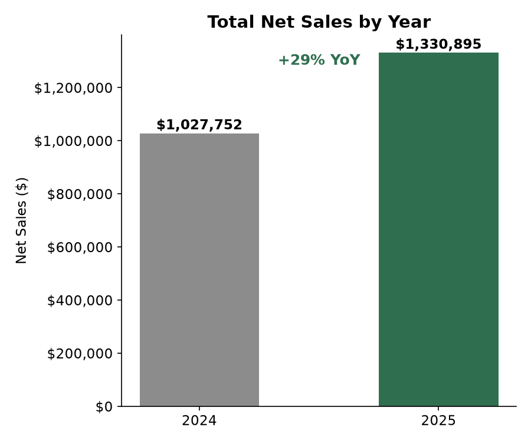
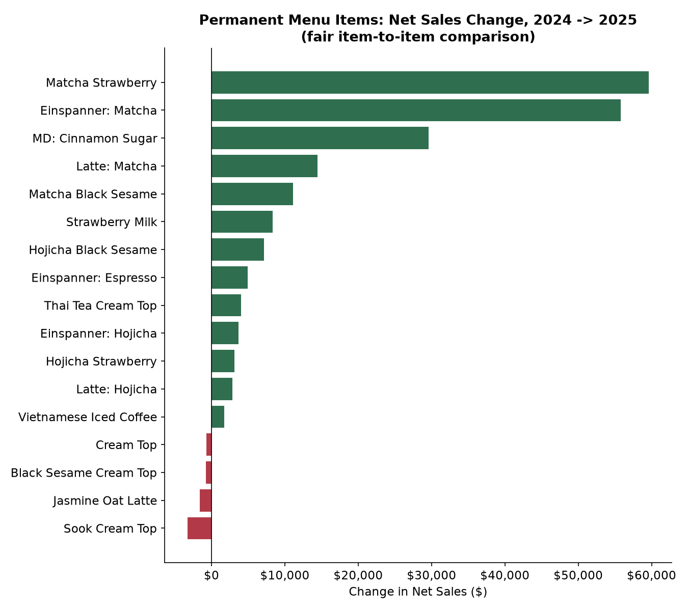
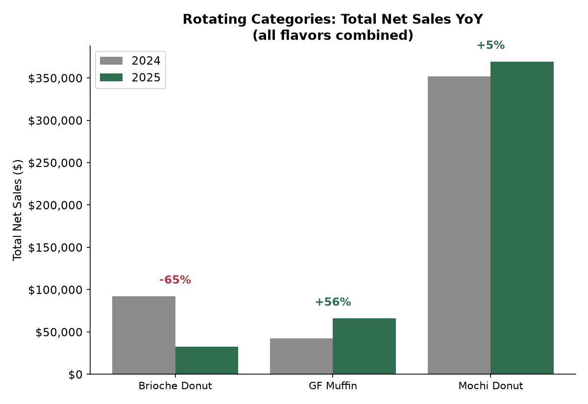
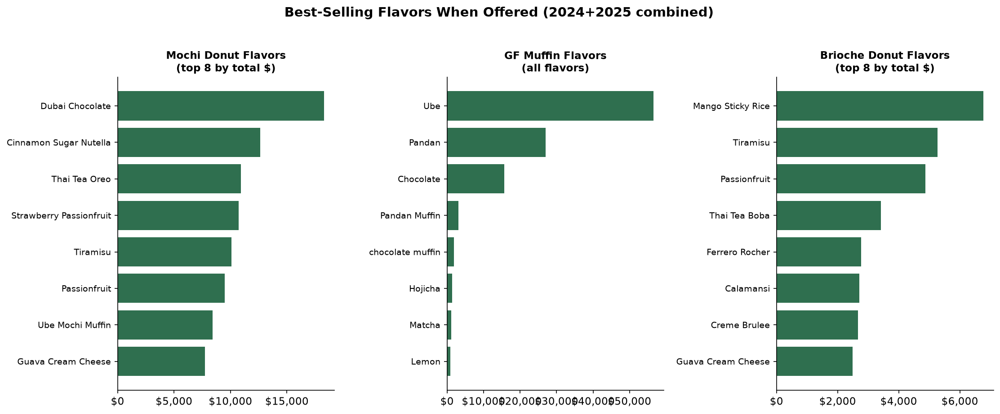

# Kin Bakeshop Sales: 2024 vs 2025 Year-over-Year Analysis

## Data & Method

Source: Square's Item Sales Summary export for 2024 and 2025 (one row per item per year). This analysis covers year-over-year item
performance.

**Cleaning notes:**
- Removed the "Custom Amount" line.
- Square splits an item into multiple rows if it was recategorized mid-year. These were
  collapsed back into one row per item per year, keeping the category with the larger sales
  share as the item's "main" category for that year.

It is important to note that not every item on the menu is a fixed product:

| Type | Rotation | Example |
|---|---|---|
| Permanent drinks (16 total) | Always available | Matcha Latte, Vietnamese Iced Coffee |
| Mochi Donuts | Flavors rotate weekly, except Cinnamon Sugar (fixed) | This week's flavors |
| GF Mochi Muffins | Flavors rotate daily (Black Sesame/Chocolate/Ube/Pandan) | Today's flavor |
| Brioche Donuts | Weekend-only, flavors rotate | This weekend's flavor |

Comparing an individual rotating flavor's sales year-over-year can be misleading. This analysis splits into two fair comparisons: permanent items
(compared item-by-item) and rotating groups (compared as a total category).

---

## 1. Overall Growth

| Metric | 2024 | 2025 | Change |
|---|---|---|---|
| Net Sales | $1,027,752 | $1,330,895 | **+29.5%** |
| Units Sold | 227,321 | 264,334 | **+16.3%** |
| Avg. price per unit | $4.52 | $5.03 | **+11.3%** |

Revenue grew faster than unit volume, meaning average spend per item sold went up.

## 2. Permanent Menu Items

These 16 drinks (as well as the Cinnamon Sugar Mochi Donut) are on the menu every
day of both years, so we can fairly compare sales from 2024 to 2025:

- **Growing the most:** Matcha Strawberry (+147%, +$59.6K), Matcha Einspanner (+63%, +$55.8K),
  Cinnamon Sugar Mochi Donut (+104%, +$29.6K), Matcha Latte (+78%, +$14.5K). 
- **Declining:** Ssuk/Mugwort Cream Top (-34%), Jasmine Oat Latte (-13%), Black Sesame Cream
  Top (-2%), Cream Top (-11%). It's important to note that the Ssuk lost a third of its sales.

## 3. Rotating Categories

Total category revenue for baked goods:

- **Brioche Donuts fell 65%** ($92K → $32K)
- **GF Muffins grew 56%** ($42K → $66K)
- **Mochi Donuts were essentially flat** (+5%, $352K → $369K)

## 4. Popular Flavors Per Baked Goods

Displayed below are the best performing flavors combining metrics from both 2024 and 2025. 

Dubai Chocolate and Cinnamon Sugar Nutella lead mochi donuts; Ube is the runaway leader among
GF muffins (far ahead of the next flavor); Mango Sticky Rice and Tiramisu lead brioche donuts.

Interestingly enough, the Dubai Chocolate outperformed the Cinnamon Sugar for mochi donuts, despite Cinnamon Sugar being the only permament menu item.

---

## Takeaways

1. **29.5% revenue growth with only 16.3% more units sold**. Each sale is worth more on average now than a year ago.
2. **Matcha Strawberry, Matcha
   Einspanner, and Matcha Latte** are the three biggest dollar-growth items.
3. **Brioche Donuts are down sharply (-65%) as a category.** Though this could just be a result of selling brioches less frequently in 2025.
4. **Mochi Donuts are flat year-over-year.** This stays consistent with the amount that we make and sell daily.
5. **Ube is a standout flavor** for GF muffins specifically and are far ahead of every other flavor
   in that rotation.

---
