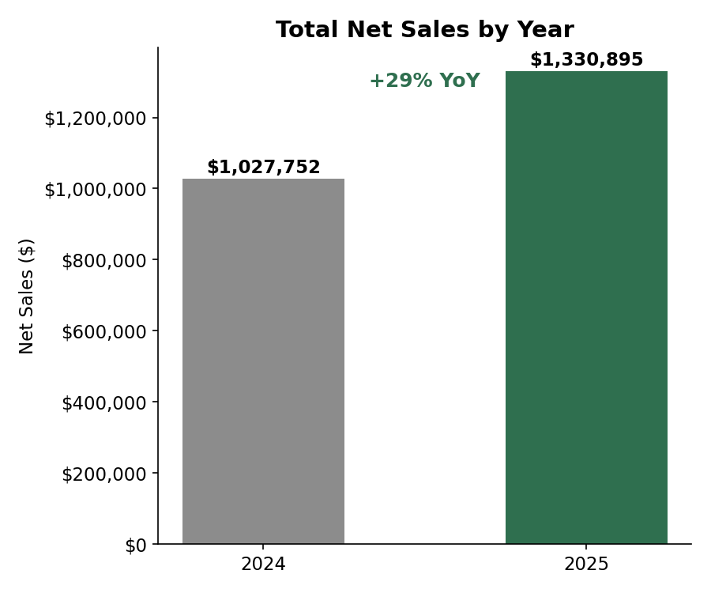
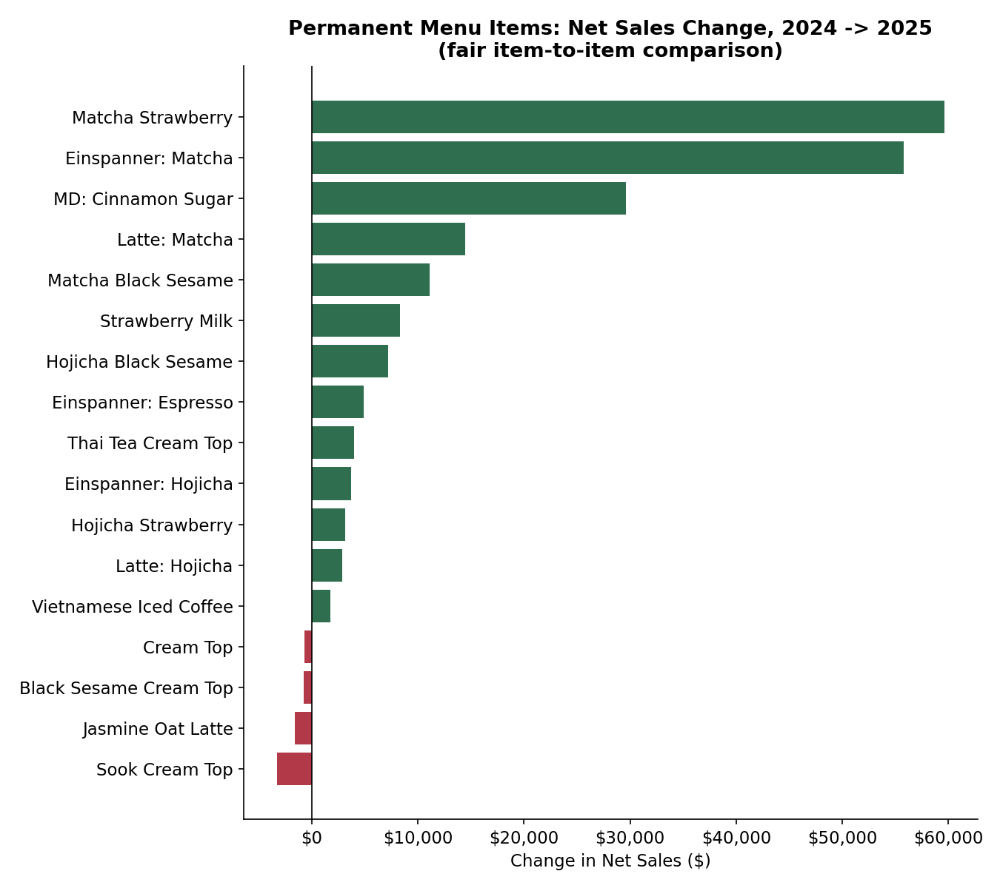
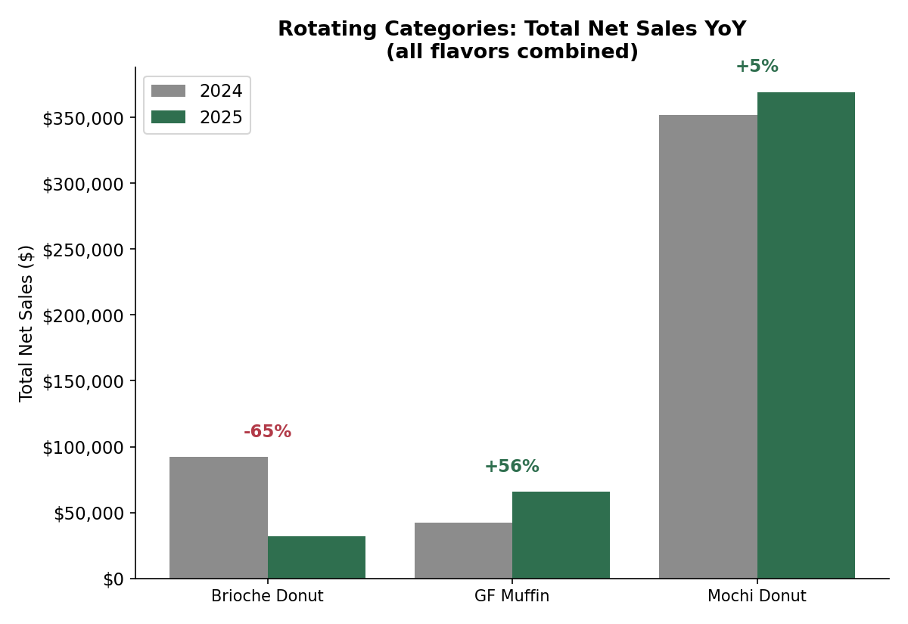
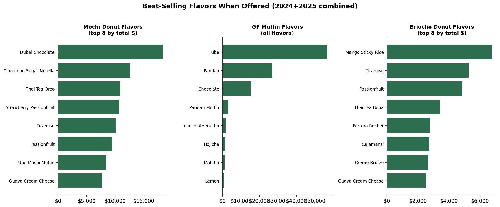

# Cafe Sales: 2024 vs 2025 Year-over-Year Analysis

## Data & Method

Source: Square's Item Sales Summary export for 2024 and 2025 (one row per item per year).
No timestamps are included in this export, so this analysis covers **year-over-year item
performance**, not within-year trends (peak hours/days would need a transaction-level export).

**Cleaning notes:**
- Removed the "Custom Amount" line (manual charges, not a real menu item).
- Square splits an item into multiple rows if it was recategorized mid-year — these were
  collapsed back into one row per item per year, keeping the category with the larger sales
  share as the item's "main" category for that year.

**Menu structure matters a lot here.** Not every item on the menu is a fixed, ongoing product:

| Type | Rotation | Example |
|---|---|---|
| Permanent drinks (16 total) | Always available | Matcha Latte, Vietnamese Iced Coffee |
| Mochi Donuts | Flavors rotate weekly, except Cinnamon Sugar (fixed) | this week's flavor |
| GF Mochi Muffins | Flavors rotate daily (Black Sesame/Chocolate/Ube/Pandan) | today's flavor |
| Brioche Donuts | Weekend-only, flavors rotate | this weekend's flavor |

Comparing an individual rotating flavor's sales year-over-year is misleading — a flavor
showing "$3,000 less" might just mean it was offered fewer weeks that year, not that it's
losing popularity. So this analysis splits into two fair comparisons: **permanent items**
(compared item-by-item) and **rotating groups** (compared as a total category).

---

## 1. Overall Growth

| Metric | 2024 | 2025 | Change |
|---|---|---|---|
| Net Sales | $1,027,752 | $1,330,895 | **+29.5%** |
| Units Sold | 227,321 | 264,334 | **+16.3%** |
| Avg. price per unit | $4.52 | $5.03 | +11.3% |

Revenue grew faster than unit volume, meaning average spend per item sold went up — a mix of
price increases, a shift toward higher-priced items, or both.

## 2. Permanent Menu Items — the fair comparison

These 16 drinks (plus the one fixed mochi donut flavor, Cinnamon Sugar) are on the menu every
day of both years, so this is a genuine apples-to-apples read on what's winning and losing:

- **Growing the most:** Matcha Strawberry (+147%, +$59.6K), Matcha Einspanner (+63%, +$55.8K),
  Cinnamon Sugar Mochi Donut (+104%, +$29.6K), Matcha Latte (+78%, +$14.5K). Matcha is clearly
  the standout flavor trend across the permanent lineup.
- **Declining:** Ssuk/Mugwort Cream Top (-34%), Jasmine Oat Latte (-13%), Black Sesame Cream
  Top (-2%), Cream Top (-11%). These are small dollar amounts relative to the winners, but
  worth watching — especially Ssuk, which lost a third of its sales.

## 3. Rotating Categories — compared as a whole

Since individual flavors rotate, the fair comparison here is total category revenue:

- **Brioche Donuts fell 65%** ($92K → $32K) — the single biggest change in the whole dataset.
  This is a real, meaningful drop and worth a direct conversation with your manager: was
  weekend availability cut, did fewer flavors get made, or is this a genuine demand drop?
- **GF Muffins grew 56%** ($42K → $66K) — solid real growth.
- **Mochi Donuts were essentially flat** (+5%, $352K → $369K) — despite individual flavors
  looking like they "grew" or "declined" a lot, the category as a whole barely moved. Flavor
  level swings here are mostly rotation noise, not real trend.

## 4. Which flavors perform best when offered

Not a trend metric (since not every flavor was offered in both years) — this just shows which
flavors earn the most on the days/weeks they're in rotation, useful for deciding what to bring
back more often:

Dubai Chocolate and Cinnamon Sugar Nutella lead mochi donuts; Ube is the runaway leader among
GF muffins (far ahead of the next flavor); Mango Sticky Rice and Tiramisu lead brioche donuts.

---

## Takeaways

1. **The cafe grew significantly** — 29.5% revenue growth with only 16.3% more units sold
   means each sale is worth more on average now than a year ago.
2. **Matcha is the clear winning flavor among permanent items** — Matcha Strawberry, Matcha
   Einspanner, and Matcha Latte are your three biggest dollar-growth items.
3. **Brioche Donuts are down sharply (-65%) as a category** — this is the most actionable
   finding in the whole analysis and worth investigating directly, separate from any single
   flavor's performance.
4. **Mochi Donuts, your biggest single category, are flat year-over-year** — growth is coming
   from elsewhere (matcha drinks, GF muffins), not from the mochi donut rotation.
5. **Ube is a standout flavor** for GF muffins specifically — far ahead of every other flavor
   in that rotation, worth considering as a more permanent fixture.

---

## Other questions this same dataset could answer

You already have everything needed (`classified_sales.csv`, `cleaned_sales.csv`) to explore
these without asking for any new data:

- **Discount/comp rate by category.** The `Discounts & Comps` column is already in the data —
  compare discount $ as a % of gross sales across permanent vs. rotating items, or by category.
  Are certain categories discounted more heavily than others?
- **Refund rate by item or category.** Same idea using `Items Refunded` / `Refunds` — is
  anything getting refunded disproportionately often? Could point to a quality or description
  issue.
- **"Long tail" analysis.** With 319 mochi donut flavors and 122 brioche donut flavors ever
  offered, how much of total rotating-category revenue comes from the top 10 flavors vs. the
  rest? (An 80/20-style analysis — useful for deciding whether to shrink the rotation.)
- **Price-point analysis.** `Net Sales / Units Sold` per item gives you an effective average
  price — are the growing items also the pricier ones, or is growth coming from cheaper,
  higher-volume items?
- **Category concentration / risk.** What % of total revenue comes from your single largest
  category (Mochi Donuts)? If it's very concentrated, that's a business risk worth naming even
  though the category is currently healthy.
- **"Never repeated" flavors.** Out of 319 mochi donut flavors, how many were only ever run
  once? That's a proxy for how much true experimentation is happening in the rotation vs. a
  smaller core rotation of favorites.

**Needs new data (a transaction-level export with timestamps) to answer:**
- Peak hours/days, staffing needs
- Whether the Brioche Donut decline is tied to specific weekends, weather, or season
- Whether matcha's growth is steady over the year or concentrated in certain months
- Basket analysis (what gets ordered together)
